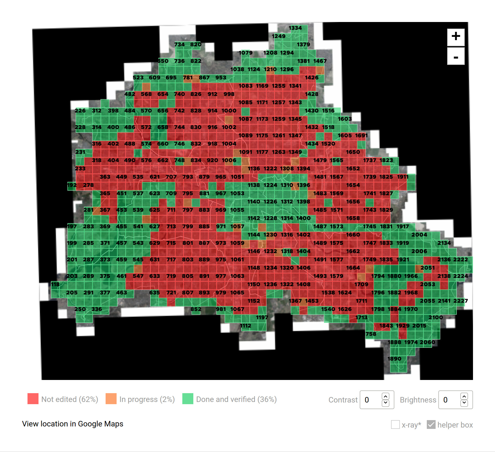
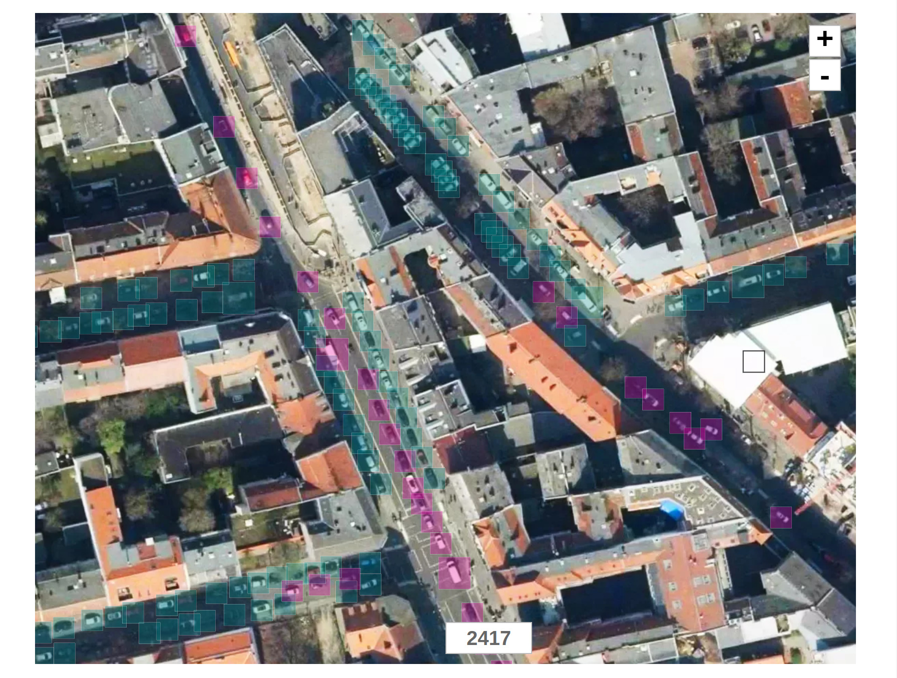

# A Map Tagging Tool

A simple web based tool to tag things on a map. No code here yet.

## Features
- A map
- A grid on top of the map where each grid can be "unlocked" by users
- The possibility to draw squares
- A square preview around the mouse cursor
- A set of key shortcuts:
  - undo
  - set square size 
  - delete a specific square
- Set the contrast and brightness of the base map
- A google link to the current map view
- Download the tagging data
- Upload the tagging data (to continue tagging)
- Preview tagging data

